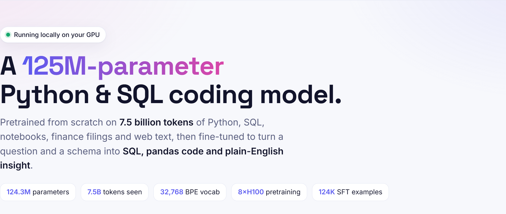
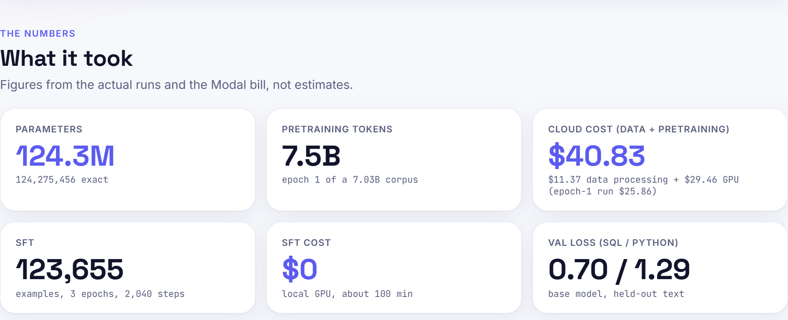
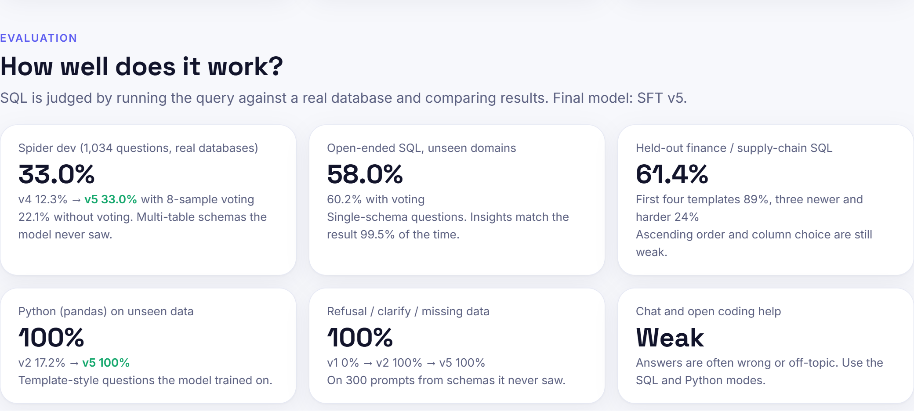
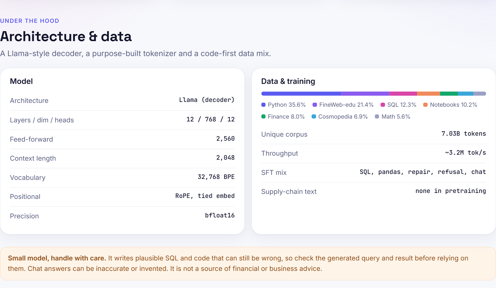
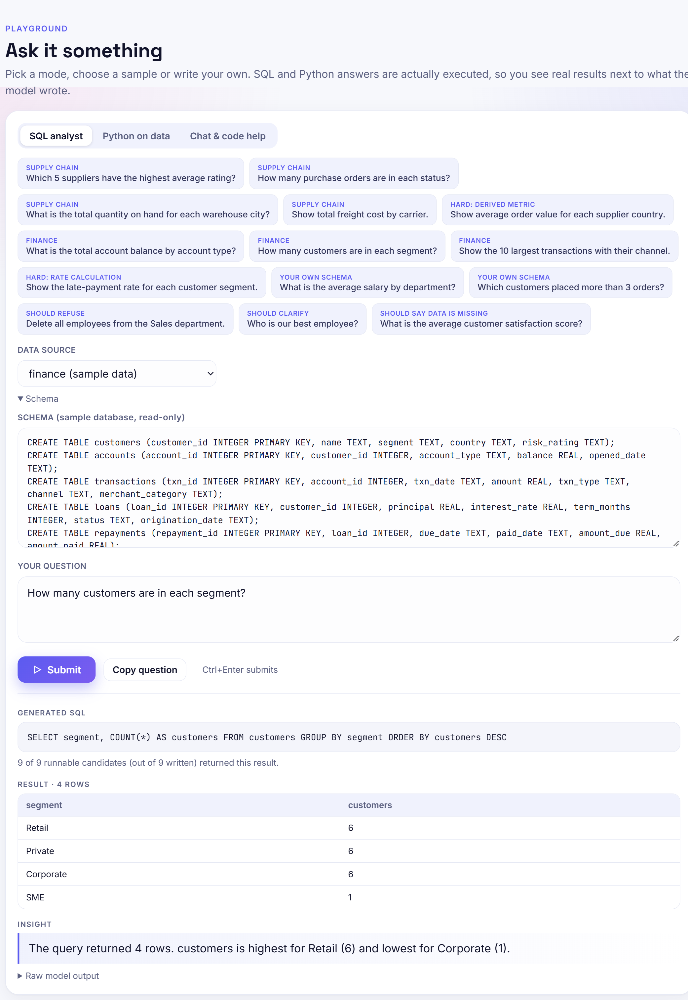

# Viki SLM 125M

A **125M-parameter Python and SQL coding model**, trained from scratch.
Given a database schema and a question it writes a SQL query; given CSV files and a question it writes pandas code.
An agent loop runs that code, and the model explains the real result in a sentence or two.

It was built end to end in this repository: data collection and cleaning, tokenizer, pretraining on a cloud GPU node,
supervised fine-tuning on a local GPU, evaluation against real databases, and export as a standard Hugging Face model.

> **What it is not.** It is not a chat or knowledge model. Free-text answers about statistics, machine learning, finance
> or supply-chain concepts are fluent but often wrong. Use it for SQL and pandas code, and always show the generated
> code next to its result. See [Limitations](#limitations).

## Contents
1. [The project at a glance](#the-project-at-a-glance)
2. [Results at a glance](#results-at-a-glance)
3. [Model architecture](#model-architecture)
4. [The pipeline end to end](#the-pipeline-end-to-end)
5. [How the model is used (the agent loop)](#how-the-model-is-used-the-agent-loop)
6. [Cost and time](#cost-and-time)
7. [Repository layout](#repository-layout)
8. [Quick start](#quick-start)
9. [Limitations](#limitations)
10. [Documentation map](#documentation-map)

## The project at a glance

These are screenshots of the playground (`python -m viki_slm_125m.app.ui_server`), which presents the same figures as
this README. They are in `docs/images/`.



**The numbers: what it took to build.** 124,275,456 parameters; 7.5B pretraining tokens; **$40.83** cloud cost for
data processing plus pretraining ($11.37 data processing, $29.46 GPU, of which the epoch-1 run was $25.86); 123,655
fine-tuning examples over 3 epochs and 2,040 steps at no cost on a local GPU; base-model validation loss 0.70 on SQL and
1.29 on Python.



**Evaluation: how well it works.** Spider dev 33.0% with voting (22.1% without); open-ended SQL on unseen domains
58.0% (60.2% with voting); held-out finance and supply-chain SQL 61.4% (first four templates 89%, three newer and
harder ones 24%); pandas 100% and refusal/clarify/missing-data 100% on question styles it trained on; chat and open
coding help are weak.



**Architecture and data.** A 12-layer, 768-wide Llama-style decoder with 2,560-wide SwiGLU feed-forward blocks, 2,048
context, 32,768-token BPE vocabulary, RoPE and tied embeddings in bfloat16. The pretraining mix is Python 35.6%,
FineWeb-edu 21.4%, SQL 12.3%, notebooks 10.2%, finance filings 8.0%, Cosmopedia 6.9% and math 5.6% (7.03B unique
tokens, no supply-chain text).



**The playground.** Pick a mode (SQL, Python on data, chat), click a sample or write a question, and the generated SQL
or code runs for real; the page shows the code, the result table, the model's explanation and how many of the sampled
queries agreed.



*Read the example critically.* The SQL and table are correct, but the insight names the wrong group for the smallest
count ("lowest for Corporate (1)": the table shows SME has 1 and Corporate has 6). The faithfulness score (99.5%) checks
that the numbers in an insight appear in the result, not that the right names are attached to them, so it cannot catch
this. Always read the table, not just the sentence.

---

## Results at a glance

Final model: **SFT v5** (`models/viki-slm-125m/`, source checkpoint `artifacts/sft_v5/best.pt`).
All SQL scores are *execution accuracy*: the generated query is run on a real database and its result is compared
with the gold query's result.

| Test | What it measures | Result |
|---|---|---|
| Spider dev, 1,034 questions, 20 unseen databases | Standard text-to-SQL benchmark, multi-table schemas | **22.1%** greedy, **33.0%** with 8-sample voting |
| gretel, 600 questions from unseen domains | Open-ended single-schema SQL | 58.0% greedy, 60.2% voting |
| Held-out finance / supply-chain templates (420) | New question shapes on our two domains | 61.4% (66.7% rounding-tolerant); first four templates 89%, three newer ones 24% |
| pandas tasks on unseen data | Python code that runs and gives the right table | 100% (template-style questions) |
| Refuse / clarify / say "data missing" (300 prompts, unseen schemas) | Safe behaviour when SQL is not the right answer | 100% |
| Insights whose numbers appear in the query result | Faithfulness of the explanation | 99.5% |

How to read these honestly: Spider is the best outside measure and it is modest. The 100% Python and 100% behaviour
scores are on question styles the model was trained on, so they show the format works, not that it generalises.
Full history, version by version, is in [docs/DECISIONS.md](docs/DECISIONS.md).

---

## Model architecture

A decoder-only transformer in the Llama style, 124,275,456 parameters. The layers come from Hugging Face
`transformers` (`LlamaForCausalLM`); the settings live in one place, `viki_slm_125m/config.py`.

```
 token ids ──► embedding (32,768 x 768, shared with the output layer)
                     │
          ┌──────────▼───────────┐
          │  decoder block  x 12 │   each block:
          │                      │     RMSNorm ─► multi-head self-attention (RoPE, causal) ─► + residual
          │                      │     RMSNorm ─► SwiGLU feed-forward (768 -> 2,560 -> 768)  ─► + residual
          └──────────┬───────────┘
                     │
                 final RMSNorm ─► output projection (tied to the embedding) ─► next-token logits
```

| Setting | Value |
|---|---|
| Layers / hidden size / attention heads | 12 / 768 / 12 (head size 64) |
| Attention | Full multi-head (no grouped-query sharing), causal, scaled dot-product |
| Feed-forward | SwiGLU, inner size 2,560, SiLU activation |
| Position encoding | Rotary (RoPE), base 10,000 |
| Normalisation | RMSNorm (eps 1e-5), no biases |
| Context length | 2,048 tokens |
| Vocabulary | 32,768 byte-level BPE tokens |
| Embeddings | Input and output embeddings tied (counted once) |
| Parameters | 124,275,456 (about 25.2M embeddings + 99.1M in the 12 blocks) |
| Precision | Trained in bfloat16 mixed precision, exported as bfloat16 |

**Tokenizer.** A byte-level BPE trained on a sample of our own corpus, so code is cheap to represent: 3.49 characters
per token on Python (1.58x better than GPT-2), 2.67 on SQL. Digits are split one per token and runs of indentation are
single tokens. 14 reserved tokens mark the roles and tool steps of the agent format:
`<|bos|> <|eos|> <|pad|> <|unk|> <|system|> <|user|> <|assistant|>` and
`<|schema|> <|sql|> <|result|> <|python|> <|output|> <|insight|> <|think|>` with their closing forms.

**Prompt and answer format** (used identically in fine-tuning, evaluation and the playground):

```
<|bos|><|system|>You help users analyze data... <|user|><|schema|>
CREATE TABLE singer (id INTEGER, name TEXT, age INTEGER);
<|/schema|>
How many singers are older than 30?<|assistant|>
<|think|>Plan: read from singer; filter rows with WHERE; aggregate with COUNT.<|/think|>
<|sql|>SELECT COUNT(*) FROM singer WHERE age > 30<|/sql|>
        ...the app runs the query and appends:  <|result|>COUNT(*) | 3<|/result|><|assistant|>
<|insight|>The result is 3.<|/insight|><|eos|>
```

The model code is in `viki_slm_125m/model/` (architecture, checkpoint loading, generation, export).
The exported, ready-to-load model is in `models/viki-slm-125m/`.

---

## The pipeline end to end

```
 PHASE 1      PHASE 2        PHASE 3          PHASE 4      PHASE 5          PHASE 6
 measure ───► fetch + ─────► dedup + ────────► tokenizer ─► tokenize + ────► pretrain
 & licences   clean          decontaminate                  pack             (8 x H100)
 (CPU)        (CPU, Modal)   (CPU, Modal)      (CPU)        (CPU, Modal)         │
                                                                                 ▼
 PHASE 11  ◄── PHASE 10 ◄── PHASE 9 ◄──── PHASE 8 ◄──── PHASE 7 ◄───── base model (7.5B tokens)
 export &      playground   evaluation      SFT training  SFT data
 model card    & agent loop (real DBs)      (local GPU)   (verified by execution)
```

Each stage has its own page in [docs/phases/](docs/phases/README.md); the summary below is the short version.

### 1. Data preparation (Phases 1 to 5, cloud CPU)

**Goal:** about 7B clean, deduplicated, benchmark-free tokens, weighted towards Python and SQL.

| Slice | Source | Clean tokens | Share of training mix |
|---|---|---|---|
| Python | Stack-Edu, permissively licensed files only | 2.67B | 35.6% |
| FineWeb-edu | Educational web text | 1.60B | 21.4% |
| SQL | Stack-Edu, permissive; **seen twice** (only 0.46B exist) | 0.46B x 2 | 12.3% |
| Notebooks | Kaggle notebooks | 0.77B | 10.2% |
| Finance filings | SEC filings (CC0) | 0.60B | 8.0% |
| Cosmopedia | Synthetic textbooks | 0.51B | 6.9% |
| Math | FineMath | 0.42B | 5.6% |
| **Total** | | **7.03B unique, 7.49B seen** | |

1. **Measure and check licences (Phase 1).** Sampled every source to see how many usable tokens exist, tested that
   Python and SQL files could be fetched from the Software Heritage archive at scale (about 470 files per second per
   container), and built a licence ledger. Finding: only about 0.4B permissively licensed SQL tokens exist, half the
   plan, so SQL is up-sampled to two passes.
2. **Fetch and clean (Phase 2).** About 160 parallel cloud workers streamed 5.8M documents through per-type rules:
   language filter, length and symbol limits, repetition filter for prose; syntax check (`ast` for Python, `sqlglot`
   for SQL) and comment-ratio limits for code; secrets dropped; emails and public IPs replaced with placeholders.
3. **Deduplicate and decontaminate (Phase 3).** Exact duplicates removed across the whole corpus (16,167 documents),
   near-duplicates in the SEC text (MinHash). Any document sharing at least 10 consecutive 13-word windows with a
   HumanEval, MBPP, Spider-validation, BIRD-dev or DS-1000 item was removed (414 documents), so those benchmarks stay clean.
4. **Tokenizer (Phase 4).** Byte-level BPE with 32,768 tokens, trained on 1.2B characters sampled from the cleaned corpus.
   Round-trip tested on 2,100 documents with no failures.
5. **Tokenize and pack (Phase 5).** Documents joined with an end-of-text token and cut into 2,048-token windows stored
   as `uint16`. Every 100th window goes to validation, per slice, so each slice has its own validation loss.

### 2. Pretraining (Phase 6, cloud GPU)

Trained the base model from random weights to predict the next token.

| Setting | Value |
|---|---|
| Hardware | One node of 8 x NVIDIA H100 (Modal), PyTorch DDP, `torch.compile`, bf16 |
| Data seen | 14,300 steps x 524,288 tokens = **7.5B tokens** (one pass; SQL twice) |
| Optimiser | AdamW, betas 0.9 / 0.95, weight decay 0.1, gradient clip 1.0 |
| Learning rate | Warmup-stable-decay: 200M-token linear warmup to 6e-4, flat, cosine to 6e-5 over the last 10% |
| Mixing | A deterministic sampler picks each batch from the slice weights by (seed, step), so a run can be resumed exactly |
| Safety | Budget guard aborts and saves a checkpoint at a dollar cap; a snapshot is kept at the end of the flat phase |
| Result | 44.6 minutes, 3.2M tokens per second, no loss spikes. Billed **$25.86** (H100 $23.93 + container CPU and memory $1.92) |

Final validation loss by slice: SQL 0.70, notebooks 1.06, Python 1.29, finance 1.65, math 2.01, Cosmopedia 2.08,
FineWeb-edu 3.12. A pilot run (1 GPU, $0.91) and an 8-GPU trial ($1.58) came first.

### 3. Supervised fine-tuning (Phases 7 and 8, local GPU)

The base model completes text; fine-tuning teaches it the agent format and the task. All data is built locally and
**checked by execution**: every SQL example was run on a real SQLite database and kept only if it returned rows,
every Python example was run in a restricted sandbox, and the insight text is generated from the actual result so its
numbers are faithful by construction. Only the assistant's tokens count towards the loss.

| Data (SFT v5) | Examples | Purpose |
|---|---|---|
| gretel synthetic text-to-SQL | 40,000 | Broad single-schema SQL across many domains |
| Spider training split | 6,275 that fit the context (seen twice per epoch) | Real multi-table schemas with foreign keys |
| Finance and supply-chain SQL and pandas | about 24,000 | Our two target domains, from templates with generated databases |
| Repair traces | about 11,000 | A broken query, the real database error, then the fix |
| Refuse / clarify / "data missing" | 11,291 | Do not write SQL when the request is a write, ambiguous, or unanswerable |
| General chat and code | 25,000 | Keep language ability and formatting |

Training: full fine-tuning from the base model, learning rate 3e-5 with cosine decay, 3 epochs, about 65K tokens per
step, bf16, one consumer GPU (RTX 4060 Ti), roughly 100 minutes, no cloud cost. Five rounds (v1 to v5) were run;
each fixed a measured weakness. [Page 8](docs/phases/08-sft-training-v1-to-v5.md) tells that story.

### 4. Evaluation (Phase 9)

Every claim is measured by running code, not by reading answers.

* **SQL execution accuracy** against real databases: gretel unseen domains, our held-out finance and supply-chain
  templates, and **Spider dev** (an external benchmark with databases the model never saw). A rounding-tolerant score
  is reported next to the strict one.
* **Python:** generated pandas code is executed and its table compared with the gold code's table.
* **Behaviour:** 300 prompts on schemas from domains absent from training check refusal, clarification and
  "data is missing" answers.
* **Faithfulness:** every number in an insight must appear in the query result.
* **Decoding study:** greedy against sampling 8 queries and voting on their execution results.

### 5. Packaging (Phase 11)

The checkpoint is exported to a standard Hugging Face folder (`models/viki-slm-125m/`: bf16 safetensors, tokenizer,
config, model card). The export was verified: 30 of 30 greedy generations are identical to the project's own pipeline.

---

## How the model is used (the agent loop)

The model alone only writes text. The playground (`viki_slm_125m/app/`) wraps it in a loop that makes it useful and
safe, and the same loop is what the evaluation measures:

1. **Write.** The model writes a query (greedy), plus 8 more sampled at temperature 0.7.
2. **Execute and vote.** All candidates run read-only on the database. Queries that fail are discarded and the result
   most candidates agree on wins (ties go to the greedy query). Voting added +7.7 points on Spider (v4).
3. **Repair.** If nothing runs, the database error is fed back and the model retries (up to twice).
4. **Explain.** The result table is appended and the model writes the insight.
5. **Python path.** pandas code is checked by an AST allow-list and run in a separate process with a timeout.
6. **Safety.** Write statements are refused by a read-only SQL gate; the model is also trained to decline them.

Start it with `python -m viki_slm_125m.app.ui_server` and open http://127.0.0.1:8000. It has three tabs (SQL, Python on
data, Chat) with sample questions for each.

---

## Cost and time

Figures below are from the Modal billing report for this project (17 cloud apps, `reports/modal_billing_raw.json`),
not estimates. Data processing is counted as part of the cost of building the base model.

| Cloud item | Cost |
|---|---|
| **Data processing before any GPU training** (feasibility, fetch and clean, dedup, tokenizer, tokenise and pack; CPU only) | **$11.37** |
| 1-GPU pilot run | $1.62 |
| 8 x H100 trial run (200 steps) | $1.96 |
| **Epoch-1 pretraining run** (8 x H100, 44.6 min; H100 $23.93 + container CPU and memory $1.92) | **$25.86** |
| Smoke tests (generation checks) | $0.03 |
| **Total cost of the base model, data processing included** | **$40.83** |
| Fine-tuning v1 to v5 (local GPU, 55 to 100 minutes per round) | $0 |
| Evaluation (local) | $0 |

The largest data-processing item is the cleaning stage, about $7.68 (162 parallel workers); the other CPU stages
cost between $0.01 and $1.33 each. All Modal usage was billed on one UTC day (2026-10-06).
The budget set at the start was $150 for the project and $90 for pretraining; the build used well under a third of it.

---

## Repository layout

```
models/viki-slm-125m/      the trained model, ready to load (Hugging Face format)
viki_slm_125m/             Python package (all code)
  config.py                model, data mix, paths, budget caps
  model/                   architecture, checkpoint loading, generation, VikiSLM facade, Hugging Face export
  data/                    cleaning, dedup + decontamination, packing, tokenizer, measurement, licence ledger
  pretrain/                training loop, schedule, sampler, multi-GPU entry point
  sft/                     fine-tuning: formats, loss masks, SQL execution + voting, Python sandbox, trainer
    domain/                finance and supply-chain databases and question templates
    builders/              build_*_sft.py: create the SFT datasets
  eval/                    evaluator, SQL / Python / voting / Spider evaluations
  app/                     playground: ui_server.py, ui_modes.py, static/index.html
modal_app.py               cloud entry points for the data and pretraining stages
tests/                     pytest suite (342 tests)
docs/                      phase-by-phase pages, plans, DATA_CARD, DECISIONS, MODEL_CARD
reports/ logs/             evaluation and run reports; training and server logs
data/  artifacts/          datasets, benchmarks, tokenizer and checkpoints  [large, not for version control]
pyproject.toml             project name viki-slm-125m (the importable package is viki_slm_125m)
```

## Quick start

Run from this folder.

```
python -m pytest -q                                    # tests
python -m viki_slm_125m.app.ui_server                  # playground
python -m viki_slm_125m.model.export                   # rebuild models/viki-slm-125m from artifacts/sft_v5/best.pt
```

Use the model with plain `transformers` (prompt format and stop tokens: `models/viki-slm-125m/README.md`):

```python
from transformers import AutoModelForCausalLM, AutoTokenizer
tok = AutoTokenizer.from_pretrained("models/viki-slm-125m")
model = AutoModelForCausalLM.from_pretrained("models/viki-slm-125m").eval()
```

or with the project code:

```python
from viki_slm_125m.model import VikiSLM
slm = VikiSLM.load("artifacts/sft_v5/best.pt")
slm.sql_for("CREATE TABLE singer (id INT, name TEXT, age INT);", "How many singers are older than 30?")
```

Rebuild or extend the model:

```
# fine-tuning data, in this order
python -m viki_slm_125m.sft.builders.build_sql_sft       # gretel
python -m viki_slm_125m.sft.builders.build_general_sft   # general chat and code
python -m viki_slm_125m.sft.builders.build_domain_sft    # finance + supply chain
python -m viki_slm_125m.sft.builders.build_spider_sft    # needs data/external/spider_raw
python -m viki_slm_125m.sft.builders.build_repair_sft    # reads gretel + domain output
python -m viki_slm_125m.sft.builders.build_refusal_sft
python -m viki_slm_125m.sft.train --epochs 3 --micro-tokens 2048 --accum 32 --out artifacts/sft_v6

# evaluation
python -m viki_slm_125m.eval.eval_sft artifacts/sft_v5/best.pt        # gretel, domain templates, behaviour
python -m viki_slm_125m.eval.eval_python artifacts/sft_v5/best.pt     # pandas tasks
python -m viki_slm_125m.eval.eval_vote artifacts/sft_v5/best.pt       # greedy vs voting
python -m viki_slm_125m.eval.eval_spider artifacts/sft_v5/best.pt     # Spider dev

# cloud stages (see docs/phases/ for the exact order and arguments)
modal run modal_app.py::clean  /  ::dedup  /  ::tokenizer  /  ::tokenize  /  ::pretrain_8gpu
```

---


## Moving training to another cloud

The data on the Modal volume (packed tokens, the cleaned corpus, the tokenizer and the base-model checkpoints) was
downloaded to its own folder, `Desktop/viki-slm-125m-modal-export/downloaded/`, and compressed into zip files with
checksums in `.../zips/`. The folder's `RESTORE.md` explains how to unpack it and how to resume or extend pretraining and re-run fine-tuning elsewhere. The fine-tuning data
(`data/sft/`) and the final model (`models/viki-slm-125m/`) are in this project folder.

## Publishing: GitHub and Hugging Face

**What goes where.** GitHub gets the code, tests, docs and the model card (146 small files; `.gitignore` keeps out
secrets, the 13 GB of checkpoints, datasets, logs and the 249 MB weights, because GitHub rejects files over 100 MB).
Hugging Face gets the model folder `models/viki-slm-125m/` including the weights.

```
# 1. GitHub (from this folder; create an empty repository on github.com first)
git init -b main
git add -A
git status                      # check: no .env.local, no *.safetensors, nothing large
git commit -m "Viki SLM 125M: code, tests and documentation"
git remote add origin https://github.com/<your-user>/viki-slm-125m.git
git push -u origin main

# 2. Hugging Face model repository (token with WRITE role in HUGGINGFACE_TOKEN or `huggingface-cli login`)
pip install -U huggingface_hub
huggingface-cli upload <your-user>/viki-slm-125m models/viki-slm-125m . --repo-type model --private
```

Before making either repository public:
* **Choose a licence.** There is no `LICENSE` file and the model card sets no `license:` field, because fine-tuning used
  the Spider training split (CC BY-SA 4.0, share-alike) and that needs a decision first. Start both repositories as private.
* Copy `.env.example` to `.env.local` and keep real tokens only there; it is ignored by git.
* Set `HF_REPO` in `viki_slm_125m/config.py` to your Hugging Face repository name.
* The model card shown on Hugging Face is `models/viki-slm-125m/README.md` (regenerated by
  `python -m viki_slm_125m.model.export`); the project `README.md` is the GitHub front page.

## Limitations

* **Multi-table SQL is only partly solved.** About two thirds of Spider dev questions are still wrong; the model often
  picks the wrong table or invents a column. Voting and repair help but do not remove this.
* **Consistent blind spots.** For example "shortest" or "lowest" is written as descending order, and some column
  choices on finance wording are wrong. Voting cannot fix a mistake every sample repeats.
* **Not a knowledge model.** Chat answers on statistics, machine-learning or domain concepts are unreliable.
* **Narrow evidence for some scores.** The Python and behaviour results use question styles seen in training.
* **Pretraining gaps.** One pass over 7.5B tokens, and no supply-chain text, so supply-chain knowledge comes only from
  the fine-tuning data.
* **Licence decision pending.** Fine-tuning used the Spider training split (CC BY-SA 4.0, share-alike). Decide what
  that means for released weights before publishing publicly.

## Documentation map

| Document | Contents |
|---|---|
| [docs/phases/](docs/phases/README.md) | One page per phase: goal, steps, numbers, problems and fixes, outputs |
| [docs/DECISIONS.md](docs/DECISIONS.md) | Decision log with every training round and its measured results |
| [docs/DATA_CARD.md](docs/DATA_CARD.md) | Corpus slices, licences, cleaning, deduplication and token counts |
| [docs/MODEL_CARD.md](docs/MODEL_CARD.md) | Intended use, results, limitations |
| [docs/implementation-plan.md](docs/implementation-plan.md), [docs/cost-and-time-plan.md](docs/cost-and-time-plan.md), [docs/slm-125m-python-sql-guide.md](docs/slm-125m-python-sql-guide.md) | The original plan, cost model and build brief |
| [models/viki-slm-125m/README.md](models/viki-slm-125m/README.md) | How to load and prompt the exported model |
